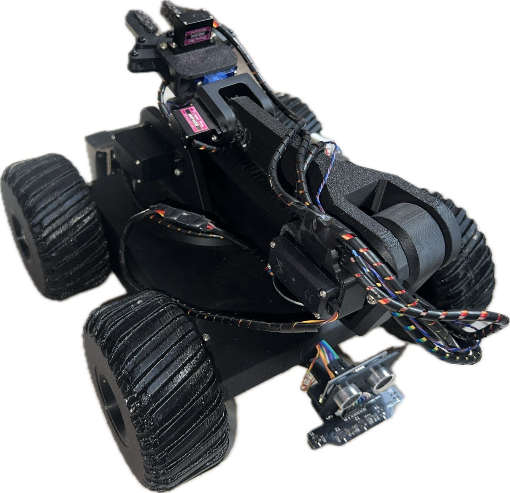
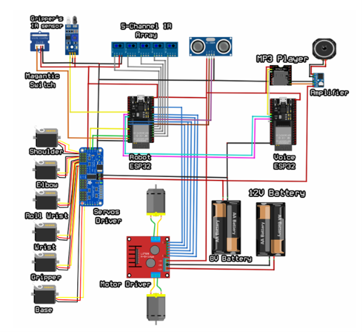

# مشروع التخرج: Speech Controlled Robot

هذا هو المستودع الخاص بمشروع تخرجي. ستجد هنا التصاميم ثلاثية الأبعاد (3D Files)، المخططات الإلكترونية، وأكواد التشغيل.

---

## 🤖 الروبوت الخاص بالمشروع
هذه صورة للروبوت بعد التجميع النهائي:

### شرح فكرة المشروع
* **الهدف:** روبوت متكامل يتم التحكم فيه بالأوامر الصوتية ولديه القدرة على الحركة.
* **كيف يعمل:** ينقسم المشروع إلى نظامين أساسيين يعملان معاً (مستقبل للصوت، ومحرك للسيارة والذراع) باستخدام متحكمات ESP32 لضمان الاتصال السريع والتنفيذ الفوري للأوامر.

---

## 💻 شرح الأكواد البرمجية (Firmware)

يحتوي المشروع على كودين أساسيين لكل منهما وظيفة محددة:

1. **ESP32 Voice Brain FINAL:**
   * **الوظيفة:** هذا الكود مخصص لمتحكم الـ ESP32 المسؤول عن **التعامل مع الأصوات**.
   * **دوره:** يقوم بالتقاط الأوامر الصوتية، وتحليلها، ومعالجتها لإرسال التوجيهات إلى باقي أجزاء الروبوت.

2. **ESP32 Rover FINAL:**
   * **الوظيفة:** هذا الكود مخصص لمتحكم الـ ESP32 المسؤول عن **حركة السيارة والذراع الروبوتية**.
   * **دوره:** يستقبل الأوامر ويتحكم في المحركات لتحريك السيارة (الروبوت) ميكانيكياً بالإضافة إلى توجيه محركات السيرفو (Servo Motors) الخاصة بالذراع البرمجية لأداء المهام.

---

## 🔌 مخطط التوصيلات الإلكترونية
يوضح هذا المخطط كيفية ربط الحساسات، والمتحكمات (ESP32)، ومصادر الطاقة معاً:

### تفاصيل التوصيل السريعة
* **مستقبل الصوت** ➡️ متصل بـ **ESP32 Voice Brain**
* **محركات الحركة والسيرفو** ➡️ متصلة بـ **ESP32 Rover**
* تأكد من توصيل خط الأرضي (GND) المشترك بين القطع لضمان استقرار الإشارة.

---

## 📺 الفيديوهات الشارحة للمشروع

### 1️⃣ فيديو شرح كيفية تركيب المشروع كاملاً:
اضغط على الصورة بالأسفل للانتقال إلى فيديو الشرح على يوتيوب:

### 2️⃣ فيديو شرح كيفية تركيب الذراع الروبوتية بشكل خاص:
اضغط على الصورة بالأسفل للانتقال إلى فيديو شرح الذراع على يوتيوب:

